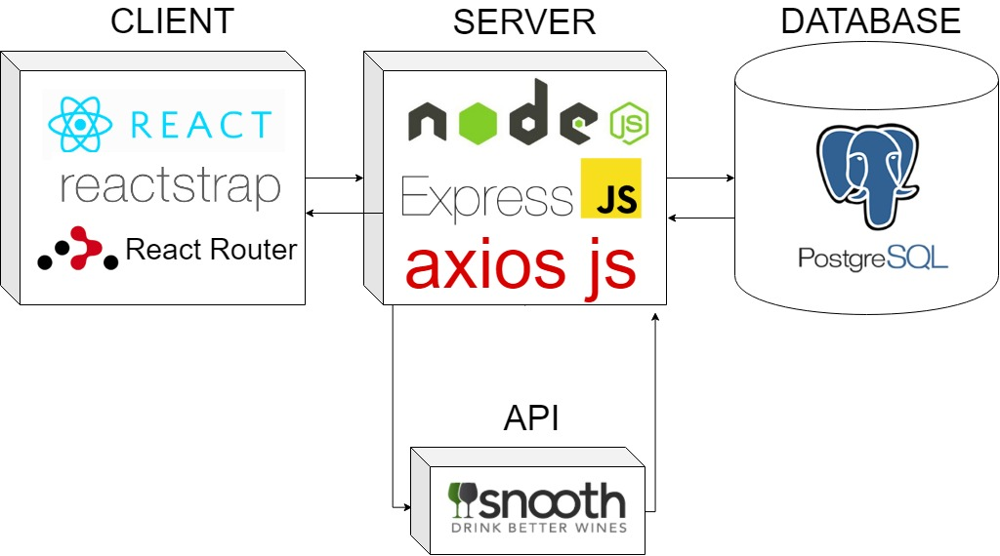

# SommeWine

"Your personal Sommelier" 

SommeWine is the solution to the every day wine drinker. 
There is nothing worse than tasting a great wine over dinner just to forget it's name. No need to keep a stash of empty wine bottles around
to remember your favorites. SommeWine is your personal Cellar, and Sommelier. By communicating with a wine api/database, Snooth, you have
access to thousands wines from around the world.

##  FEATURES

### Login Error Handling and Sign Up Error Handling
Communicating with the database, users can Sign Up and or Login to the application. A dynamic error handling system renders if the wrong password is used, upon Login, or a username is already in use, upon Sign Up.

### Advanced Search 
A plethora of taste palette and regional preference options are available for advanced search capabilities. This allows for more specific and targetted wine querying of the Snooth Wine API to expand user's taste palette/wine knowledge. 

### Saving to Favorites and Taste List
Dynamic interations with various tables in the postgreSQL database allows for users to save and delete various wines to their favorites list and their Taste List. The Taste List offers users a place to store a persisted list wines they may have come accross and would like to try in the future.

### Saving and Updating User Preference
To get and give accurate user information, a user can save an update their `Wine Type`, `Flavors/Notes`, and `Region/Country` preferences. 

## TECH STACK
  * React
  * React Router Dom
  * Reactstrap
  * Node.js
  * ExpressJS
  * Express Router
  * Axios js
  * PostgreSQL

 
  

